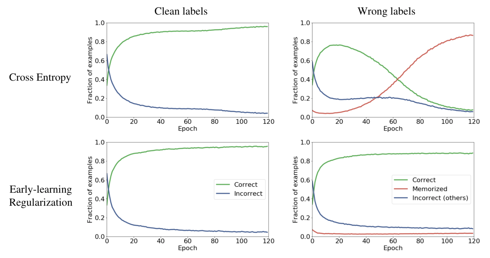

# Early-Learning Regularization Prevents Memorization of Noisy Labels
This repository is the official implementation of [Early-Learning Regularization Prevents Memorization of Noisy Labels](https://arxiv.org/abs/2007.00151) (2020).

We propose a novel framework to perform classification via deep learning in the presence of noisy annotations. When trained on noisy labels, deep neural networks have been observed to first fit the training data with clean labels during an "early learning" phase, before eventually memorizing the examples with false labels. Our technique exploits the progress of the early learning phase via regularization to perform classification from noisy labels. There are two key elements to our approach. First, we leverage semi-supervised learning techniques to produce target probabilities based on the model outputs. Second, we design a regularization term that steers the model towards these targets, implicitly preventing memorization of the false labels. The resulting framework is shown to provide robustness to noisy annotations on several standard benchmarks and real-world datasets, where it achieves results comparable to the state of the art.

<p float="left" align="center">
 
<figcaption align="center">
These graphs show the results of training a ResNet-34 with a traditional cross entropy loss (top row) and our proposed method (bottom row) to perform classification on the CIFAR-10 dataset where 40% of the labels are flipped at random. The left column shows the fraction of examples with clean labels that are predicted correctly (green) and incorrectly (blue). The right column shows the fraction of examples with wrong labels that are predicted correctly (green), memorized (the prediction equals the wrong label, shown in red), and incorrectly predicted as neither the true nor the labeled class (blue). The model trained with cross entropy begins by learning to predict the true labels, even for many of the examples with wrong labels, but eventually memorizes the wrong labels. Our proposed method based on early-learning regularization prevents memorization, allowing the model to continue learning on the examples with clean labels to attain high accuracy on examples with both clean and wrong labels.
</figcaption>
</p>


## Requirements
- This codebase is written for `python3`.
- To install necessary python packages, run `pip install -r requirements.txt`.


## Training
### Basics
- All functions used for training **ELR** can be found in the `ELR` folder.
- All functions used for training **ELR+** can be found in the `ELR_plus` folder.
- Experiments settings and configurations used for different datasets are in the corresponding config json files.
### Data
- Please downlowd the data before running the code, add diretory to the downloaded data and modify the `data_loader.args.data_dir` in the corresponding config file.
### Training
- Code for training ELR is in the following files: [`train.py`](./ELR/train.py), code for training ELR+ is in the following files: [`train.py`](./ELR_plus/train.py) 
```
usage: train.py [-c] [-r] [-d] [--lr learning_rate] [--bs batch_size] [--beta beta] [--lambda lambda] [--malpha mixup_alpha]
                [--percent percent] [--asym asym] [--ealpha ema_alpha]  [--name exp_name] 

  arguments:
    -c, --config                  config file path (default: None)
    -r, --resume                  path to latest checkpoint (default: None)
    -d, --device                  indices of GPUs to enable (default: all)     
  
  options:
    --lr learning_rate            learning rate (default value is the value in the config file)
    --bs batch_size               batch size (default value is the value in the config file)
    --beta beta                   temporal ensembling momentum beta for target estimation
    --lambda lambda               regularization coefficient
    --malpha mixup_alpha          mixup parameter alpha
    --percent percent             noise level (e.g. 0.4 for 40%)
    --asym asym                   asymmetric noise is used when set to True
    --ealpha ema_alpha            weight averaging momentum for target estimation
     --name exp_name              experiment name
```
Configuration file is **required** to be specified. Default option values, if not reset, will be the values in the configuration file. 
Examples for ELR and ELR+ are showed in the *readme.md* of `ELR` and `ELR_plus` subfolders respectively.
## Lisence and Contributing
- This README is formatted based on [paperswithcode](https://github.com/paperswithcode/releasing-research-code).
- Feel free to post issues via Github. 

## Reference
For technical details and full experimental results, please refer [our paper](https://arxiv.org/abs/2007.00151).
```

```
## Contact
Please contact shengliu@nyu.edu if you have any question on the codes.
